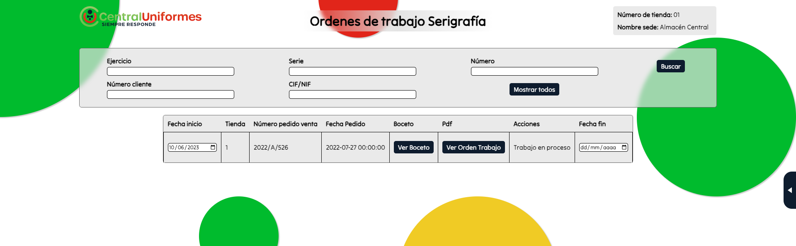

# Introducción

La aplicación surge por la necesidad de digitalizar el proceso de realizar un pedido a serigrafía por lo tanto el objetivo sera realizar una app para gestionar toda la información necesaria a la hora de hacer los pedidos y un formulario para hacer los pedidos, asi como una gestion de los pedidos enviados para que serigrafia los pueda controlar.

# Manual de Usuario 

Una vez iniciada la aplicación lo primero que se mostrará será una pantalla de login en la cual podremos elegir si queremos entrar sin iniciar sesión o con un usuario y una contraseña. Entremos de la forma que entremos lo primero que veremos será la tabla de clientes de la que hablaremos más tarde.

## Iniciar sesión

Si hemos entrado sin iniciar sesión y queremos iniciar haremos click en el botón "Iniciar sesión" en el menú de la derecha

## Cerrar sesión

Si hemos iniciado sesión y queremis cerrarla haremos click en el botón "Cerrar sesión" en el menú de la derecha

## Volver atrás

Para volver a la página anterior haremos click en el botón "Volver" de la esquina superior izquierda.

## Serigrafía 

Serigrafía entrará con usuario y contraseña ya que tendrá unos permisos que no conviene que otros usuarios tengan.

Nada más entrar, a la derecha de la pantalla tendremos un menú que nos permitirá desplazarnos entre las diferentes secciones de la aplicación.

### Clientes

La primera pantalla que nos aparece al entrar es en la que se muestran los clientes. Nada más llegar no nos aparecerá ningún resultado, pero podremos filtrar dichos clientes según su CIF/NIF, su código de cliente o su razón social.

Cuando encontremos el cliente deseado podemos hacer click en él y entrar para ver sus todos sus datos.

En este menú podremos ver, además de los datos del cliente, sus logotipos, bocetos y ordenes de trabajo. También podremos editar la información del usuario y añadir logotipos y bocetos.

En la pantalla de editar cliente podremos modificar cualquier dato salvo el CIF/NIF.

### Logos

Al hacer click en el botón "Subir logo" se abrirá un selector de archivos en el que podremos elegir la imagen que queremos subir.

Una vez subido el logo podremos editar su estado de "activo" a "obsoleto" y viceversa y añadir una imagen vectorizada

### Bocetos

Siguiendo el mismo procedimiento podemos subir un boceto el cuál debe tener formato pdf. Una vez subido tendremos la opción de ver dicho pdf y añadir una versión firmada del mismo boceto.

### Ordenes de trabajo

En la tabla de ordenes de trabajo se mostrará la información de los pedidos que tengan ordenes de trabajo. Serigrafía no puede realizar ordenes de trabajo.

### Nuevo trabajo

En la opción "Nuevo Trabajo" del menú lateral podremos elegir un pedido y generar una orden de trabajo eligiendo para cada artículo el tipo de artículo que es, la posición en la que queremos el logo, el tipo de trabajo que queremos realizar y el logotipo que deseamos. En la parte inferior hay una caja de texto en la que podremos agregar observaciones extra al pedido. En el caso de seleccionar un logo nulo deberemos obligatoriamente especificar lo que deseamos trabajar.

Arriba a la derecha hay un menú que nos indica si falta algún dato por concretar en el formulario. Debajo de este, hay otro menú que nos permite seleccionar un boceto para asociarlo a esta orden de trabajo y previsualizarlo. Sin embargo, no es obligatorio ya que como veremos lo podremos asociar más tarde.

El usuario de serigrafía no puede enviar ordenes de trabajo, pero si puede usarlo para hacer pruebas.

### Posiciones

En la sección "Posiciones", podremos crear nuevas posiones en las que podremos colocar los logotipos, además de editarlas y deshabilitarlas.

### Tipos de artículos

En la sección "Tipos de artículos", podremos crear nuevas tipos de artículos que podremos asociar a los artículos de los pedidos, además de editarlos, deshabilitarlas y asociarles posiciones.

Para asociar posiciones a los tipos de artículo, hacemos click en "Editar posiciones" y podremos eliminar y añadir posiciones a un determinado tipo de artículo.

### Tipos de trabajo

En la sección "Tipos de trabajo" podremos crear, editar y deshabilitar los diferentes tipos de trabajo.

### Pedidos de venta

En la sección "Pedidos de venta" podremos ver los datos de todos los pedidos de venta, el estado de la documentación y los motivos por los que no está en proceso. Podremos filtrarlos por ejercicio, serie y número.

También podremos añadir un boceto después de haberlo asociado al cliente haciendo click en "Añadir boceto".

Haciendo click en "Añadir orden de trabajo" podremos añadir la orden de trabajo e indicar si está firmada.

Por último, si hacemos click en un pedido podremos ver toda su información más sus ordenes de trabajo. Además, podremos ver toda la información del cliente asociado haciendo click en "Ver datos cliente".

### Trabajos serigrafía

En la sección "Trabajos serigrafía" podremos ver los datos de las ordenes de trabajo, filtrarlas por cliente, ejercicio, serie y número. Por defecto, solo se mostraran los trabajos pendientes, pero haciendo click en "Mostrar todos" podermos ver todos.

Podremos editar las fechas de inicio y fin. Ver los bocetos y ordenes de trabajo si es que existen y eliminar los trabajos a no ser que ya estén en progreso.

Por último, si hacemos click en una orden podremos ver mejor sus detalles.

## Tienda

El empleado de la tienda entrará sin inciar sesión.

Nada más entrar, a la derecha de la pantalla tendremos un menú que nos permitirá desplazarnos entre las diferentes secciones de la aplicación.

### Clientes

La primera pantalla que nos aparece al entrar es en la que se muestran los clientes. Nada más llegar no nos aparecerá ningún resultado, pero podremos filtrar dichos clientes según su CIF/NIF, su código de cliente o su razón social.

Cuando encontremos el cliente deseado podemos hacer click en él y entrar para ver sus todos sus datos.

En este menú podremos ver, además de los datos del cliente, sus logotipos, bocetos y ordenes de trabajo. También podremos editar la información del usuario y añadir logotipos y bocetos.

En la pantalla de editar cliente podremos modificar cualquier dato salvo el CIF/NIF y el número de cliente.

### Logos

Al hacer click en el botón "Subir logo" se abrirá un selector de archivos en el que podremos elegir la imagen que queremos subir.

Una vez subido el logo podremos editar su estado de "activo" a "obsoleto" y viceversa.

### Bocetos

En la tabla de bocetos tendremos la opción de ver dicho boceto y añadir una versión firmada del mismo.

### Ordenes de trabajo

En la tabla de ordenes de trabajo se mostrará la información de los pedidos que tengan ordenes de trabajo.

### Nuevo trabajo

En la opción "Nuevo Trabajo" del menú lateral podremos elegir un pedido y generar una orden de trabajo eligiendo para cada artículo el tipo de artículo que es, la posición en la que queremos el logo, el tipo de trabajo que queremos realizar y el logotipo que deseamos. En la parte inferior hay una caja de texto en la que podremos agregar observaciones extra al pedido. En el caso de seleccionar un logo nulo deberemos obligatoriamente especificar lo que deseamos trabajar.

Arriba a la derecha hay un menú que nos indica si falta algún dato por concretar en el formulario. Debajo de este, hay otro menú que nos permite seleccionar un boceto para asociarlo a esta orden de trabajo y previsualizarlo. Sin embargo, no es obligatorio ya que como veremos lo podremos asociar más tarde.

### Pedidos de venta

En la sección "Pedidos de venta" podremos ver los datos de todos los pedidos de venta hechos en la tienda en la que nos encontremos, el estado de la documentación y los motivos por los que no está en proceso. Podremos filtrarlos por ejercicio, serie y número.

También podremos añadir un boceto después de haberlo asociado al cliente haciendo click en "Añadir boceto".

Haciendo click en "Añadir orden de trabajo" podremos añadir la orden de trabajo e indicar si está firmada.

Por último, si hacemos click en un pedido podremos ver toda su información más sus ordenes de trabajo. Además, podremos ver toda la información del cliente asociado haciendo click en "Ver datos cliente".

### Trabajos serigrafía

En la sección "Trabajos serigrafía" podremos ver los datos de las ordenes de trabajo de la tienda, filtrarlas por cliente, ejercicio, serie y número. Por defecto, solo se mostraran los trabajos pendientes, pero haciendo click en "Mostrar todos" podermos ver todos los de la tienda.

Podremos ver los bocetos y ordenes de trabajo si es que existen y eliminar los trabajos a no ser que ya estén en progreso.

Por último, si hacemos click en una orden podremos ver mejor sus detalles.

# Estructura del código

Para explicar la estructuración del codigo iremos hablando en profundidad de lo que contiene cada carpeta

## BDReal
En esta carpeta se encuentran todas las peticiones que se realizan a la base de datos principal de Central Uniformes y algunos archivos adicionales con el objetivo de testear posibles errores

## CRUDS
En esta carpeta podemos ver toda la parte en la que se realizan los mantenimientos / gestión de todas las entidades de nuestra base de datos, cabe destacar que algunos archivos que deberian estar en esta carpeta han sido movidos a la carpeta raiz con motivos de facilitar el envio de imagenes y pdfs a la base de datos

## FPDF
Esta carpeta es una libreria / extensión de php la cual nos permite generar documentos pdf personalizados, los cuales usamos a la hora de generar una orden de trabajo de un pedido. En cuanto a su estructura gran parte es prescindible ya que en su mayoria se trata de documentación y tutoriales.

## Frontend
Aqui encontraremos el otro pilar de nuestra aplicación junto con 'CRUDS' en esta carpeta se encuentra todo lo relacionado con el formulario. La estructura del formulario esta divida en varios archivos para facilitar su gestión y entendimiento.

## Login
En esta carpeta se encuentra todo lo relacionado con la sesión ya que al existir dos posibles usuarios en nuestra app (Tienda o Serigrafia) estos tendran diferentes funciones habilitadas o no para simplificar su uso lo mas que podamos haciendo asi que cada rol solo pueda ver / interactuar con aquello que deberia poder ver / hacer

## Uploads
Por ultimo la carpeta uploads la cual no esta en el repositorio debido a que es la que contiene los ficheros que se van subiendo a la apliación, asi como los logos, bocetos, ordenes de trabajo etc. Por ello es importante que usar la aplicación creemos en la raiz del proyecto una carpeta de nombre 'uploads'

## Carpeta Raíz
Los archivos que estan en la carpeta raiz son los que se usan para añadir archivos a la base de datos